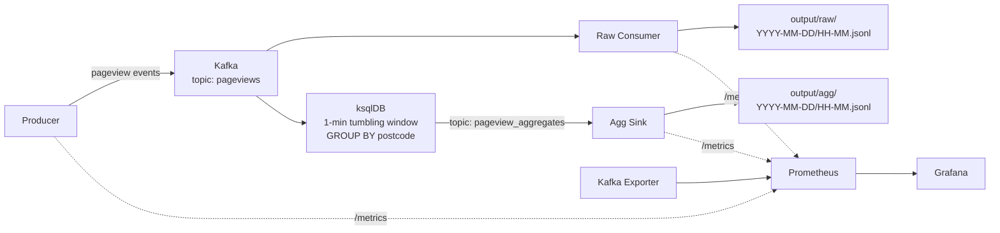

# Real-time Pageview Pipeline

A real-time streaming pipeline that ingests pageview events via Kafka, stores raw data to the local filesystem, and produces 1-minute tumbling window aggregations grouped by postcode using ksqlDB.

## Architecture



### Components

| Component | Description |
|---|---|
| **Kafka** | Single-broker KRaft cluster (no ZooKeeper). Hosts the `pageviews` source topic and `pageview_aggregates` output topic. 6 partitions, RF=1. |
| **Producer** | Python service generating synthetic pageview events at a configurable rate. Events contain `user_id`, `postcode`, `webpage`, and `event_time` (epoch ms). |
| **Raw Consumer** | Python service consuming from `pageviews` topic and writing raw events as JSONL files, partitioned by time (`YYYY-MM-DD/HH-MM.jsonl`). |
| **ksqlDB** | Runs a persistent aggregation query: 1-minute tumbling window grouped by webpage and postcode with 30-second grace period, `EMIT FINAL`. |
| **Agg Sink** | Python service consuming from `pageview_aggregates` topic and writing aggregated records as JSONL files with `webpage`, `postcode`, `window_start`, `window_end`, `pageview_count`. |
| **Prometheus** | Scrapes metrics from all Python services and Kafka Exporter on a 15-second interval. |
| **Kafka Exporter** | Exposes Kafka broker and consumer group lag metrics to Prometheus. |
| **Grafana** | Pre-configured dashboard showing producer throughput, consumer lag, flush rates, and buffer sizes. |

## Quick Start

```bash
# Start the pipeline
docker compose --env-file .env.dev up --build

# Raw events appear within seconds
ls output/raw/

# Aggregates appear after ~1.5 minutes (1m window + 30s grace period)
ls output/agg/

# Stop the pipeline
docker compose --env-file .env.dev down
```

## Output Format

### Raw (`output/raw/YYYY-MM-DD/HH-MM.jsonl`)
```json
{"user_id": 42, "postcode": "SW19", "webpage": "www.example.com/index.html", "event_time": 1611662684000}
```

### Aggregated (`output/agg/YYYY-MM-DD/HH-MM.jsonl`)
```json
{"webpage": "www.example.com/index.html", "postcode": "SW19", "window_start": "2026-08-31T16:01:00+00:00", "window_end": "2026-08-31T16:02:00+00:00", "pageview_count": 106}
```

## Configuration

All settings are managed via environment files (`.env.dev`, `.env.test`). See `.env.example` for documentation.

| Variable | Default | Description |
|---|---|---|
| `KAFKA_BOOTSTRAP_SERVERS` | `kafka:29092` | Kafka broker address |
| `PRODUCER_RATE` | `100` | Events per second |
| `RAW_CONSUMER_FLUSH_INTERVAL_SECS` | `10` | Max seconds between raw flushes |
| `RAW_CONSUMER_FLUSH_BATCH_SIZE` | `500` | Max events before a raw flush |
| `AGG_SINK_FLUSH_INTERVAL_SECS` | `30` | Max seconds between aggregate flushes |
| `AGG_SINK_FLUSH_BATCH_SIZE` | `50` | Max aggregates before a flush |
| `OUTPUT_RAW_PATH` | `/app/output/raw` | Raw output directory |
| `OUTPUT_AGG_PATH` | `/app/output/agg` | Aggregate output directory |
| `METRICS_PORT` | `8000` | Prometheus metrics HTTP port |

## Development

```bash
# Install dependencies
uv sync --all-extras

# Run unit tests
uv run pytest -m unit

# Lint & format
uv run ruff check .
uv run ruff format .
```

## Integration Tests

End-to-end tests that spin up the full Docker Compose stack via [testcontainers](https://testcontainers-python.readthedocs.io/), produce events, and verify output files.

```bash
# Run integration tests (takes ~2-3 minutes)
uv run pytest -m integration -v
```

The tests verify:
- Raw JSONL files are created with correct schema, types, and value ranges
- Aggregate JSONL files contain valid postcodes, positive counts, and 60-second window durations
- Directory structure follows `YYYY-MM-DD/HH-MM.jsonl` naming

Integration tests use `.env.test` with lower throughput settings (`PRODUCER_RATE=10`, `RAW_CONSUMER_FLUSH_INTERVAL_SECS=5`) for faster, quieter runs.

## Observability

The pipeline exposes Prometheus metrics from each Python service and includes a pre-configured Grafana dashboard.

| Endpoint | URL |
|---|---|
| Prometheus | http://localhost:9090 |
| Grafana | http://localhost:3000 (anonymous access enabled) |

### Metrics

| Metric | Service | Type | Description |
|---|---|---|---|
| `producer_events_total` | Producer | Counter | Total events produced |
| `producer_errors_total` | Producer | Counter | Delivery failures |
| `raw_consumer_events_total` | Raw Consumer | Counter | Total events consumed |
| `raw_consumer_buffer_size` | Raw Consumer | Gauge | Current buffer size |
| `raw_consumer_flush_size` | Raw Consumer | Histogram | Events per flush |
| `agg_sink_records_total` | Agg Sink | Counter | Total aggregates consumed |
| `agg_sink_buffer_size` | Agg Sink | Gauge | Current buffer size |
| `agg_sink_flush_size` | Agg Sink | Histogram | Records per flush |
| `kafka_consumergroup_lag` | Kafka Exporter | Gauge | Consumer group lag per partition |

### Grafana Dashboard

The **Pageview Pipeline** dashboard is auto-provisioned and includes:
- Producer throughput and error rate
- Consumer group lag by group (`raw-sink`, `agg-sink`)
- Raw consumer and agg sink throughput
- Buffer sizes and flush rate
